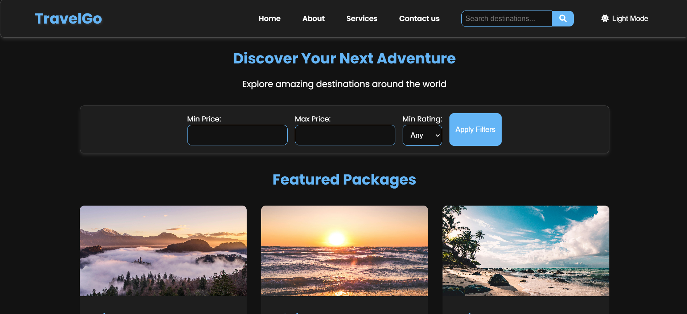

# TravelGo - Your Adventure Awaits

TravelGo is a modern, responsive web application for booking travel packages and exploring amazing destinations worldwide. This project combines a Node.js backend with Express and MySQL, and a frontend built with HTML, CSS, and JavaScript.

## Features

- Browse and search for travel packages
- Filter packages by price, rating, and date
- View featured travel packages
- Book travel packages
- Responsive design for mobile and desktop
- Dark mode toggle
- Search suggestions

## Tech Stack

- Backend:
  - Node.js
  - Express.js
  - MySQL
- Frontend:
  - HTML5
  - CSS3
  - JavaScript (ES6+)
- Additional libraries:
  - Font Awesome
  - Google Fonts (Poppins)

## Project Structure

- `server.js`: Main server file containing API endpoints and database configuration
- `public/`: Frontend files
  - `index.html`: Main HTML file
  - `style.css`: CSS styles (not provided in the context, but referenced)
  - `script.js`: Frontend JavaScript (not provided in the context, but referenced)

## Setup Instructions

1. Clone the repository:

README.md
git clone https://github.com/yourusername/travelgo.git cd travelgo

2. Install dependencies:

npm install

3. Set up the MySQL database:
- Create a new MySQL database named `travel_booking_db`
- Update the database configuration in `server.js` if necessary

4. Create a `.env` file in the root directory and add the following:

Setup all the required Creds

5. Run the server:

node server.js

6. Open your browser and navigate to `http://localhost:3000` to view the application.

## API Endpoints

- `GET /api/packages`: Fetch all travel packages (with pagination)
- `GET /api/packages/search`: Search for packages with filters
- `GET /api/packages/:id`: Get details of a specific package
- `POST /api/bookings`: Create a new booking
- `GET /api/featured-packages`: Fetch featured packages

## Contributing

Contributions are welcome! Please feel free to submit a Pull Request.

## License

This project is licensed under the MIT License.

